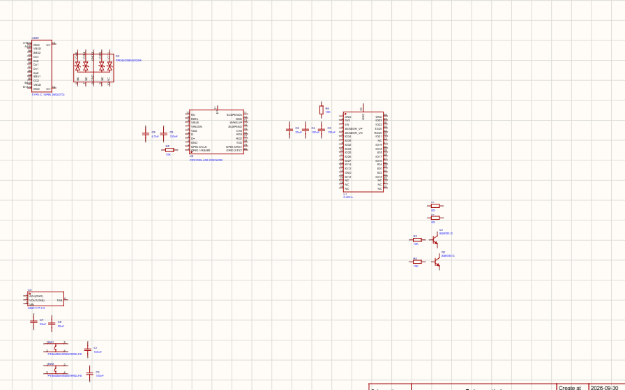

meow meow meow 

## journal 1
## Title: The start
## date 9/ 30 / 2026
## Time tracked: 50 mins

okay sooo i started for this project i wanna make an esp32 withj light all over its gonna look pretty trust did nothing much got my re schematics up opened easyeda started adding components and yeah here is the progress 
